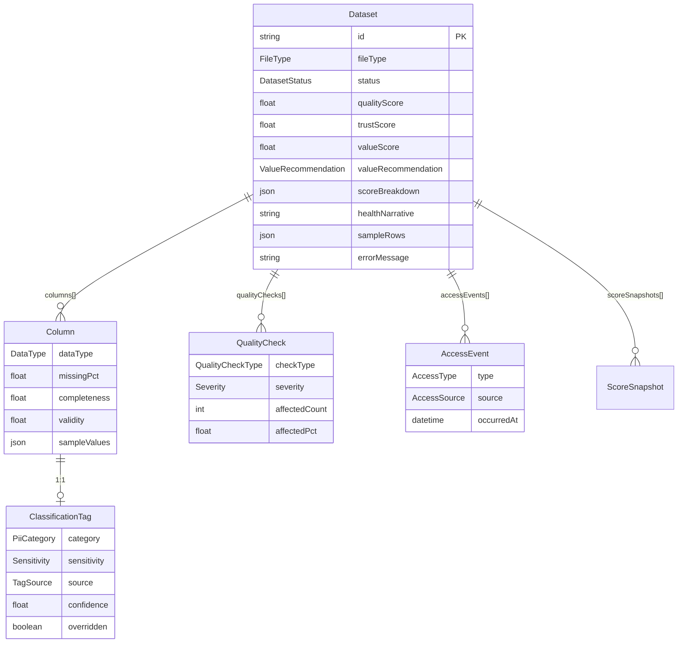
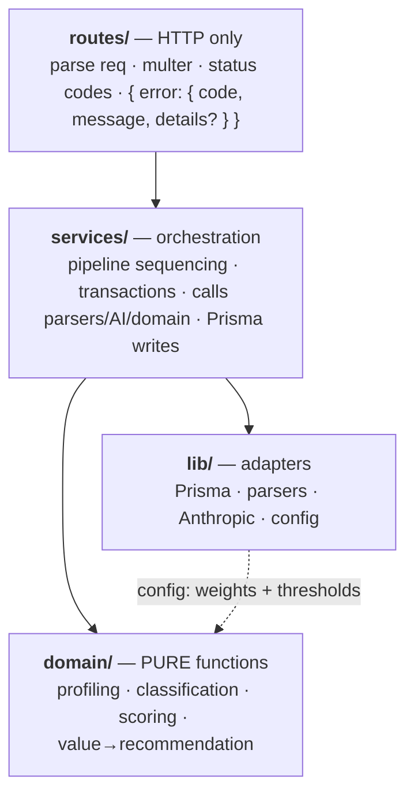

# 02 — Architecture (assay)

> Purpose: the system-level design for `assay` — context, components, data flow, layering, and the decisions behind them. **Derived from 00-SPEC.md** (the single source of truth); all entity names, enums, routes, and formulas below are taken verbatim from it. Read by the README's design-decisions section and by `10-BUILD-PLAN.md`. No code imports this file.

---

## 1. System context

`assay` is two deployables plus a managed datastore and one optional external API. The browser runs the React SPA; the SPA calls the Express API cross-origin (hence a **CORS boundary**); the API is the only thing that talks to Postgres and to Anthropic.

```mermaid
flowchart LR
    subgraph browser["Browser — user origin"]
        UI["<b>web</b> — React 18 + Vite 5 SPA<br/>TanStack Query · Recharts · shadcn/ui<br/>lib/api client"]
    end

    subgraph host["App host — api origin"]
        API["<b>api</b> — Express 4 + Prisma 5<br/>routes → services → domain<br/>multer · PapaParse · SheetJS"]
    end

    subgraph managed["Managed services"]
        DB[("Postgres 16<br/>Neon serverless")]
        AI["Anthropic API<br/>claude-haiku-4-5-20251001<br/><i>optional</i>"]
    end

    UI ==>|"HTTPS · JSON · multipart<br/>fetch → /api/*"| API
    API -->|"Prisma · pooled TCP"| DB
    API -.->|"only if GROQ_API_KEY set:<br/>ambiguous columns + healthNarrative"| AI

    classDef corsEdge stroke:#e11d48,stroke-width:3px;
    linkStyle 0 stroke:#e11d48,stroke-width:3px,color:#e11d48;
```

**The red edge is the CORS boundary.** `web` and `api` are served from different origins (static host vs. Express service), so browser `fetch` calls are cross-origin. The API enables CORS for the web origin only; multipart upload and JSON reads all cross this line. `api ↔ Postgres` and `api ↔ Groq` are server-to-server (no browser, no CORS). **The `GROQ_API_KEY` lives only in the api host's env — never shipped to the browser, never in the repo** (00-SPEC §8).

---

## 2. Component breakdown (monorepo)

pnpm-workspace monorepo, canonical layout per 00-SPEC §5. Four workspaces plus committed sample data.

| Path | Kind | Responsibility | Key deps |
|---|---|---|---|
| `apps/api` | Express service | HTTP surface + ingestion pipeline + catalog queries + Prisma persistence. Layered `routes → services → domain` (see §4). | Express 4, Prisma 5, multer, PapaParse, SheetJS, `openai` (→ Groq) |
| `apps/api/src/domain` | Pure lib | Profiling, classification, scoring, value→recommendation. **No I/O.** Primary unit-test target. | none (pure TS) |
| `apps/api/src/services` | Orchestration | Sequences the pipeline, owns transaction boundaries, calls parsers/AI/domain, writes via Prisma. | — |
| `apps/api/src/routes` | HTTP handlers | Thin Express handlers → services; status codes + error envelope. | — |
| `apps/api/src/lib` | Adapters | Prisma client, CSV/XLSX parsers, Anthropic client, config (weights + thresholds). | — |
| `apps/api/prisma` | Schema + seed | `schema.prisma` (6 models, §3); `seed.ts` loads samples + backdated `AccessEvent`s (00-SPEC §10). | — |
| `apps/web` | React + Vite SPA | `CatalogPage`, `DatasetDetailPage`; components `ui/ catalog/ dataset/ charts/`; `lib/` api client + formatters. | React 18, Vite 5, Tailwind + shadcn/ui, TanStack Query, Recharts |
| `packages/shared` | Shared TS | DTO types + enums imported by **both** api and web (the wire contract). See ADR-004. | none (framework-agnostic) |
| `samples/` | Fixtures | ≥4 messy datasets (`customers.csv`, `messy_orders.csv`, `employees.xlsx`, `events_log.csv`, `broken.csv`) engineered to exercise edge cases (00-SPEC §11). | — |
| root | Workspace | `pnpm-workspace.yaml`, `package.json`, `README.md`, `docs/` (00–10 planning docs). | — |

**Dependency direction is one-way:** `web` and `api` both depend on `packages/shared`; nothing depends on `web`; `api` never imports `web`. Inside `api`, dependencies point inward only (`routes → services → domain`, adapters in `lib`), so `domain` depends on nothing.

---

## 3. Data model (persisted entities)

Six Prisma models (00-SPEC §6), one-way relations from `Dataset`. **We persist profiles + scores, never raw rows** (ADR-002).



`sampleRows` is capped at ≤50, `Column.sampleValues` at ≤10. `AccessEvent.occurredAt` may be **backdated** for `source=SEED`. `ScoreSnapshot` is optional (powers the trend sparkline).

---

## 4. Layered design inside the API

The API is deliberately split into three layers with a strict inward dependency rule. This split **is** the "Code structure & readability" rubric line (00-SPEC §14, worth 15%).



| Layer | May do | May NOT do |
|---|---|---|
| `routes` | Read `req`, run multer, set status codes, shape the `{ error: { code, message, details? } }` envelope, delegate to one service call | Contain business logic or touch Prisma directly |
| `services` | Orchestrate the pipeline, own transactions, call `lib` adapters (Prisma/parsers/AI) and `domain` functions | Contain scoring/classification math (that lives in `domain`) |
| `domain` | Pure in→out functions over plain arrays/objects | Any I/O — no Prisma, no Express, no `fetch`, no clock/random except via injected inputs |
| `lib` | Wrap external systems + hold `config` (weights, `CLASSIFY_THRESHOLD=0.70`, `FREQ_CAP=50`, `HALFLIFE=30`) | Encode business rules |

**Why a pure `domain` layer exists:**

1. **Testability (the point of the exercise).** Scoring and classification are pure: feed rows/column-profiles in, assert scores out — no DB, no HTTP, no network mocks. This is where "Functional correctness" (20%) and "Data handling & edge cases" (15%) are earned. Vitest unit tests hit `domain` directly; Supertest covers the thin route layer.
2. **The 15% structure bucket.** `routes → services → domain` is the separation-of-concerns 00-SPEC §5/§14 explicitly rewards. Keeping HTTP, orchestration, and logic in distinct layers is legible in a "walk us through your design" conversation.
3. **Transparency (principle §2.4).** Because scoring is a deterministic pure function of a `config` weights object, every score can explain itself: the same function that computes `qualityScore` emits `scoreBreakdown`, which the UI renders as "explain this score."
4. **Graceful degradation (principle §2.3).** The optional AI adapter lives in `lib`; `domain.classify` always has a regex best-guess. AI being down changes an input, never the code path — so scoring never breaks (ADR-003).

---

## 5. Ingestion pipeline (data flow)

`POST /api/datasets` runs the full pipeline **inline** (no queue — 00-SPEC §12): upload → validate → stream-parse → profile → classify → quality checks → compute scores → persist → return summary. Large files are streamed and **capped**, never buffered whole into unbounded memory.

```mermaid
sequenceDiagram
    autonumber
    actor U as Browser (web)
    participant R as routes/datasets
    participant M as multer
    participant S as services/ingest
    participant P as lib/parsers
    participant D as domain (pure)
    participant AI as lib/llm (optional)
    participant DB as Prisma + Postgres

    U->>R: POST /api/datasets (multipart file)
    R->>M: accept upload, enforce size cap
    M-->>R: buffer + originalFilename + fileType (CSV|XLSX)
    R->>S: ingest(buffer, meta)
    S->>DB: create Dataset { status: PROCESSING }
    S->>P: stream-parse rows (PapaParse / SheetJS), bounded
    P-->>S: header + capped row stream
    Note over S,P: validate: empty file / duplicate headers / ragged rows detected here
    S->>D: profileColumns(rows) -> dataType, missingPct, distinctCount, completeness, validity, sampleValues
    S->>D: classify(columns) -> ClassificationTag (AUTO_REGEX; category, sensitivity, confidence)
    opt column ambiguous AND GROQ_API_KEY set
        S->>AI: refine(name, sampleValues) -> { category, sensitivity, confidence }
        AI-->>S: JSON (source=AUTO_AI) -- cached in DB
    end
    S->>D: runQualityChecks(rows, columns) -> QualityCheck[] (checkType, severity, affectedCount/Pct)
    S->>D: computeScores() -> Quality, Trust ; computeValue(accessEvents) -> Value + valueRecommendation
    opt GROQ_API_KEY set
        S->>AI: healthNarrative(profile, scores)
        AI-->>S: narrative string (nullable on any error)
    end
    S->>DB: persist Columns, ClassificationTags, QualityChecks, scoreBreakdown, sampleRows(<=50); Dataset { status: READY }
    S-->>R: dataset summary DTO
    R-->>U: 201 { dataset }

    Note over S,DB: hard parse/validate failure -> Dataset { status: FAILED, errorMessage }, 4xx { error } to client
```

**Scoring inputs are computed in `domain`** exactly per 00-SPEC §9:

```text
Quality = 100 × (0.40·Completeness + 0.30·Validity + 0.30·Uniqueness)
Trust   = 100 × (0.45·(Quality/100) + 0.30·Consistency + 0.25·ClassificationCoverage)
Value   = 100 × (0.45·Frequency + 0.35·Recency + 0.20·Trend)
```

with `Frequency = min(1, log1p(accesses_90d)/log1p(FREQ_CAP=50))`, `Recency = exp(−daysSinceLastAccess/HALFLIFE=30)`, `Trend = clamp01(0.5 + (accesses_last30 − accesses_prev30)/(2·max(1, accesses_prev30)))`.

**Note on Value:** on a fresh upload there are ~no `AccessEvent`s, so `valueScore` starts low. Per 00-SPEC §10, **Value recomputes on read** — `GET /api/datasets/:id` records a `DETAIL_VIEW` (`source=LIVE`) and recomputes, and the seed backdates events into hot/declining/stale/dead profiles so the demo isn't empty. `POST /:id/reprofile` recomputes scores from the **persisted** column aggregates + current `AccessEvent`s (it does not re-parse — raw rows are gone; see ADR-002).

---

## 6. Architecture Decision Records

Nygard-format ADRs (adapted from the ADR skill into this single doc). Status `accepted`, dated ISO-8601. Deciders: solo build (rxit). These record the *why* behind the shape above; the README's design-decisions section links here.

### ADR-001: Monorepo + separate Express API over Next.js

**Date**: 2026-07-21 · **Status**: accepted · **Deciders**: rxit

**Context.** The brief says "Node/Express" and grades code structure (15%) and a "walk us through your design" chat. We need a type-safe full-stack app with a clean, gradeable API boundary and shared types, deployable as a live demo.

**Decision.** A pnpm-workspace **monorepo** with `apps/api` (Express 4 + Prisma) and `apps/web` (React 18 + Vite 5) as **separate deployables**, sharing `packages/shared`. Not Next.js.

**Alternatives considered.**
- *Next.js full-stack (API routes + React).* Pros: one framework, one deploy, SSR. Cons: blends API/UI concerns; SSR unneeded for an auth-free dashboard. **Why not:** the brief explicitly says Node/Express — deviating hurts the "match the brief" signal and muddies the exact `routes → services → domain` separation being graded.
- *Two separate repos.* Pros: hard isolation. Cons: painful cross-repo type sharing, no atomic commits, double CI. **Why not:** overhead with no upside for a solo take-home.
- *Single Express app serving built React.* Pros: one origin, no CORS. Cons: couples deploy cadence, loses Vite DX, blurs the API boundary. **Why not:** the API boundary is the thing under test.

**Consequences.** Positive: API boundary matches the brief; shared types; web (static) and api (service) deploy independently. Negative: two build pipelines; must configure the **CORS boundary** between origins (§1). Risk: monorepo tooling overhead — mitigated by pnpm workspaces being near-zero-config.

### ADR-002: Compute-on-ingest — do not persist raw rows

**Date**: 2026-07-21 · **Status**: accepted · **Deciders**: rxit

**Context.** Uploads are arbitrary and potentially huge with dynamic schemas. The product needs profiles, scores, and a small preview — not the raw data. Storage is a Neon free tier.

**Decision.** Stream-parse at ingest; compute per-column aggregates + scores in `domain`; persist only `Dataset`/`Column`/`ClassificationTag`/`QualityCheck` + `scoreBreakdown` + capped `sampleRows` (≤50). Discard raw rows after the streaming pass (00-SPEC §6 storage decision).

**Alternatives considered.**
- *Persist all rows (generic table / JSON column).* Pros: reprocess anything later. Cons: unbounded rows, dynamic-schema modeling pain, blows the free tier, slow catalog. **Why not:** no product need, large downside.
- *Store the original file in a blob.* Pros: reprocess from source. Cons: needs object storage (out of scope §12), PII-at-rest liability for a demo. **Why not:** scope + risk.

**Consequences.** Positive: bounded storage, **safe large-file handling** (stream + cap), fast catalog queries. Negative: cannot re-derive *new* metrics without re-upload — `reprofile` recomputes scores from stored aggregates + `AccessEvent`s, but changing profiling *logic* needs a re-upload. Risk: a profiling bug is only fixable by re-uploading — acceptable for a take-home, noted honestly.

### ADR-003: Graceful, optional AI layer

**Date**: 2026-07-21 · **Status**: accepted · **Deciders**: rxit

**Context.** The optional LLM (Groq) can refine ambiguous classifications and write the `healthNarrative`, but principle §2.3 forbids any feature that makes the live demo look broken, and the key must never enter the repo. Cost, latency, and availability are external.

**Decision.** AI is an **optional adapter** (`lib/llm`) invoked **only** for ambiguous columns (no category ≥ `CLASSIFY_THRESHOLD` 0.70, or header/value conflict) **and only when `GROQ_API_KEY` is set**. Results are **cached in the DB** (never re-charged on read). Any missing key or error → **silent fallback** to the regex best-guess; `healthNarrative` is nullable.

**Alternatives considered.**
- *AI-first classification (always call).* Pros: best labels. Cons: per-upload cost + latency on the hot path; demo breaks if the API is down/rate-limited/keyless. **Why not:** regex already resolves the clear-cut majority at the 0.70 threshold; the risk/cost isn't worth it.
- *No AI at all.* Pros: simplest. Cons: leaves the tasteful differentiator + narrative on the table; weaker on genuinely ambiguous columns. **Why not:** cheap to add safely as a fallback-guarded adapter.

**Consequences.** Positive: demo-safe (degrades to regex), cost-bounded (ambiguous-only + cached), no secret in repo. Negative: two code paths (AI vs fallback) to test. Risk: silent fallback could mask a misconfigured key — mitigated by logging and surfacing `TagSource` (`AUTO_AI` vs `AUTO_REGEX`) in the UI so reviewers can see which path ran.

### ADR-004: Shared TypeScript types package

**Date**: 2026-07-21 · **Status**: accepted · **Deciders**: rxit

**Context.** `api` and `web` must agree on DTO shapes and enum values (`PiiCategory`, `Sensitivity`, `Severity`, `ValueRecommendation`, …). Client/server type drift is a classic full-stack bug. TS is `strict` across the stack.

**Decision.** `packages/shared` exports the DTOs + enums imported by **both** apps — one source of truth for the wire contract, aligned with the Prisma schema enums.

**Alternatives considered.**
- *Duplicate types in each app.* Pros: zero setup. Cons: silent drift — the exact bug we're avoiding. **Why not:** defeats the purpose.
- *OpenAPI client codegen.* Pros: language-agnostic contract. Cons: heavier toolchain for a take-home. **Why not:** the monorepo lets us share source types directly.
- *tRPC.* Pros: end-to-end inference. Cons: couples client to server runtime, deviates from the plain-REST surface (§7). **Why not:** overkill and off-brief.

**Consequences.** Positive: compile-time contract safety, one place to change an enum, cross-stack autocomplete. Negative: `shared` must stay framework-agnostic (no Express/React imports); a change ripples to both apps (intended). Risk: over-sharing server-only types — mitigated by exporting only DTOs/enums.

### ADR-005: Neon serverless Postgres over Render DB

**Date**: 2026-07-21 · **Status**: accepted · **Deciders**: rxit

**Context.** We need managed Postgres 16 on a free tier for a live demo (deployment is graded 10%, and the brief expects cold-start to be noted). Solo take-home, no ops budget. Prisma is the ORM.

**Decision.** **Neon** serverless Postgres (free tier) as the primary datastore, via a **pooled** connection string.

**Alternatives considered.**
- *Render managed Postgres.* Pros: same host as a Render-deployed API. Cons: free tier is time-limited/constrained. **Why not:** Neon's generous free tier + scale-to-zero + DB branching fit a demo better, and decoupling DB host from app host avoids single-vendor coupling.
- *Supabase.* Pros: batteries included. Cons: bundles auth/realtime/storage we explicitly don't need (§12). **Why not:** heavier than required.
- *SQLite / local Docker only.* Pros: trivial. Cons: SQLite lacks real concurrent-server semantics for a deployed multi-request demo and has Prisma feature gaps. **Why not:** Postgres is the realistic target.

**Consequences.** Positive: free managed Postgres 16, Prisma-native, DB branching for safe migrations. Negative: serverless **cold-start** adds first-query latency. Risk: the first demo click is slow — mitigated by pinging `GET /api/health` to warm the pool before a walkthrough and noting cold-start honestly in the README (00-SPEC §14); pooled connections respect free-tier connection limits.

---

## 7. Failure modes & graceful degradation

Everything degrades so the live demo never looks broken (principle §2.3). The `DatasetStatus` enum (`PROCESSING | READY | FAILED`) is the state machine the UI renders.

| Failure | Detected where | Behavior |
|---|---|---|
| **Empty file** | validate, after parse | `Dataset.status = FAILED`, `errorMessage` set, `4xx { error: { code, message } }`. `broken.csv` exercises this (00-SPEC §11). |
| **Duplicate headers / ragged rows / blank column** | stream-parse + profiling | **Not fatal.** Recorded as `QualityCheck` rows (`DUPLICATE_HEADER`, `EMPTY_COLUMN`, `TYPE_MISMATCH`, …) with `severity`; dataset stays `READY` with correspondingly low Quality/Consistency. |
| **Mixed types in a column** | profiling | `dataType` = dominant type; off-type values lower `validity`; `INVALID_VALUES` / `TYPE_MISMATCH` checks emitted. |
| **Oversized file** | multer cap + streaming | Size cap at upload; rows streamed and capped — never buffered whole (ADR-002). No OOM. |
| **AI down / no key / rate-limited / bad JSON** | `lib/llm` | **Silent fallback** to regex best-guess; `TagSource` stays `AUTO_REGEX`; `healthNarrative = null` (UI hides the block). Cached AI results still served. Demo unaffected (ADR-003). |
| **DB cold-start (Neon scale-to-zero)** | first query | First query slow; `GET /api/health` warms the pool; ingest shows `PROCESSING` + a loading state; transient connection errors retried; pooled connection string respects free-tier limits (ADR-005). |
| **Any unexpected error** | route error handler | Consistent `{ error: { code, message, details? } }` envelope (00-SPEC §7); never a raw stack to the client. |

---

## 8. What we'd change for production

Deliberately **out of scope** for the take-home (00-SPEC §12 forbids building these) — listed to show judgment, not to build. Framing is "today → production."

| Concern | Today (take-home) | Production change |
|---|---|---|
| **Large files** | Ingest runs **inline** on the request thread; large files streamed + capped. | Move ingest to a **job queue** (BullMQ/SQS) + worker; `POST /datasets` returns `202` + a `PROCESSING` dataset id; client polls/subscribes. Removes the size cap. |
| **Raw data** | Raw rows discarded after profiling (ADR-002). | **Object storage** (S3/R2) for the original upload → reprofile with new logic, audit, and presigned direct uploads that bypass the API for huge files. Lifts ADR-002's re-upload limitation. |
| **Access control** | No auth, single tenant (§12). | Real **authn/z**: org/user scoping, RBAC on datasets, audit log, per-tenant isolation; `GROQ_API_KEY` in a secret manager/vault rather than a plain env var. |
| **Observability** | None (§12); consistent error envelope + status enum only. | **Structured logging, tracing (OpenTelemetry), metrics + dashboards, error tracking (Sentry), alerting** on FAILED-rate and AI-fallback-rate. |
| **Hardening** | Size cap + input validation at the upload boundary. | Rate limiting on upload, upload content/AV scanning, DB backups + a migration/rollback runbook, catalog-read caching, horizontal scaling of the stateless API. |

---

*End of 02 — Architecture. All names, enums, routes, and formulas trace to 00-SPEC.md; any future divergence must be called out explicitly per 00-SPEC's preamble.*
