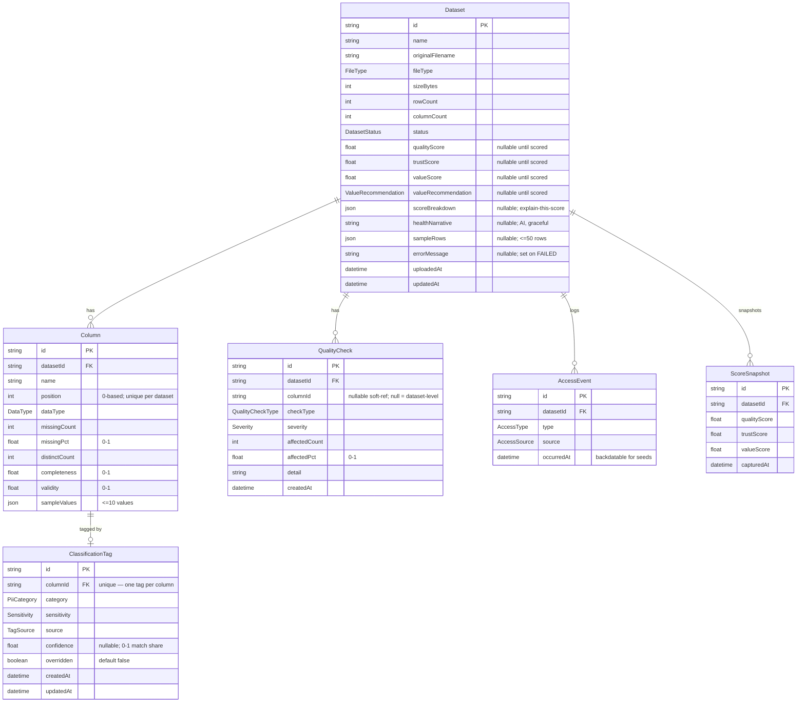

# 03 — Data Model (assay)

> Purpose: the canonical persistence design for `assay` — ERD, the real
> `prisma/schema.prisma`, and the reasoning behind every non-obvious choice.
> **Derived from 00-SPEC.md** (§6 models, §8 categories, §9 scoring, §10 seeding).
> Names, fields, and enum values below are exactly as 00-SPEC declares them — no
> renames, no invented fields. Additive production attributes (Postgres type
> mappings, one uniqueness constraint, index shapes) are called out where used.

---

## 1. Overview

Six models, one root aggregate.

- **`Dataset`** is the aggregate root: one uploaded file, profiled and scored.
- **`Column`**, **`QualityCheck`**, **`AccessEvent`**, **`ScoreSnapshot`** are its
  children — deleting a Dataset cascades to all of them.
- **`ClassificationTag`** is a 1:1 child of `Column` (one active tag per column);
  the cascade reaches it *through* `Column`.

The design follows one decision that shapes everything (see §6): **we never
persist raw rows.** At ingest we stream-parse, compute per-column profiles +
scores + capped samples, and store only those. Storage per dataset is bounded
and predictable regardless of file size.

### Status ↔ nullability lifecycle

A `Dataset` row exists from the first moment of upload, before any score is
known. The nullable score fields encode that lifecycle — they are not "optional
data", they are "not computed yet":

| `status` | qualityScore / trustScore / valueScore / valueRecommendation / scoreBreakdown / sampleRows | errorMessage |
|---|---|---|
| `PROCESSING` | `null` (pipeline running) | `null` |
| `READY` | populated | `null` |
| `FAILED` | `null` (never computed) | populated |

`healthNarrative` is independently nullable: it stays `null` when no
`ANTHROPIC_API_KEY` is set, even on a `READY` dataset (graceful AI degradation,
00-SPEC §8). This is why these fields are `Float?`/`String?`/`Json?` rather than
defaulted — a `0` score is a real, bad score and must not be confused with
"not yet scored".

---

## 2. ERD



**Cardinalities:** every child hangs off `Dataset` as one-to-(zero-or-many)
(`||--o{`) — a `FAILED` or empty dataset can legitimately have zero columns.
`Column`→`ClassificationTag` is one-to-(zero-or-one) (`||--o|`): a column may be
unclassified until the pipeline (or a reviewer) tags it.

**Note on `QualityCheck.columnId`:** it is drawn as a plain attribute, not a
relation line, on purpose. 00-SPEC models it as a bare nullable scalar with no
back-relation on `Column`; it is a *soft reference* (which column a check
concerns) rather than a FK-enforced relation. Rationale in §4.

---

## 3. `prisma/schema.prisma`

This block is the real schema — it becomes `apps/api/prisma/schema.prisma`
verbatim. Provider `postgresql`, Prisma 5.x (`prisma-client-js`).

```prisma
// assay — Prisma schema (PostgreSQL)
// Canonical model, derived from docs/00-SPEC.md §6/§8. Do not rename fields/enums.
// Storage model = compute-on-ingest: we persist per-column PROFILES, scores, and
// capped samples — never the raw uploaded rows (see 03-DATA-MODEL.md §6).
// String -> Postgres `text`, Json -> `jsonb`, DateTime -> `timestamptz(3)` (see §5).

generator client {
  provider = "prisma-client-js"
}

datasource db {
  provider = "postgresql"
  url      = env("DATABASE_URL")
}

// ───────────────────────────── Models ─────────────────────────────

/// One uploaded, profiled, scored file. Aggregate root: deleting it cascades
/// to columns, quality checks, access events, and score snapshots.
model Dataset {
  id                  String               @id @default(cuid())
  name                String // user-facing; defaults to originalFilename
  originalFilename    String
  fileType            FileType
  sizeBytes           Int
  rowCount            Int
  columnCount         Int
  status              DatasetStatus        @default(PROCESSING)

  // Scores stay null until the pipeline finishes (PROCESSING) or fails (FAILED).
  // Null = "not computed", which is distinct from a real score of 0.
  qualityScore        Float?
  trustScore          Float?
  valueScore          Float?
  valueRecommendation ValueRecommendation?

  scoreBreakdown      Json? // component sub-scores + weights, for "explain this score"
  healthNarrative     String? // AI summary; null when ANTHROPIC_API_KEY unset (graceful)
  sampleRows          Json? // capped preview, <=50 rows (cap enforced in app code)
  errorMessage        String? // set only when status = FAILED

  uploadedAt          DateTime             @default(now()) @db.Timestamptz(3)
  updatedAt           DateTime             @updatedAt @db.Timestamptz(3)

  columns             Column[]
  qualityChecks       QualityCheck[]
  accessEvents        AccessEvent[]
  scoreSnapshots      ScoreSnapshot[]
}

/// One profiled column of a dataset. `position` (0-based ordinal) is unique per dataset.
model Column {
  id                String             @id @default(cuid())
  datasetId         String
  dataset           Dataset            @relation(fields: [datasetId], references: [id], onDelete: Cascade)

  name              String // original header
  position          Int // 0-based ordinal
  dataType          DataType
  missingCount      Int
  missingPct        Float // 0–1
  distinctCount     Int
  completeness      Float // 0–1 non-null ratio
  validity          Float // 0–1 values matching inferred type
  sampleValues      Json // <=10 example values (cap enforced in app code)

  classificationTag ClassificationTag?

  // Enforces the "no two columns share an ordinal" invariant AND serves the
  // datasetId FK lookup via its leftmost prefix — so no separate @@index([datasetId]).
  @@unique([datasetId, position])
}

/// Exactly one active sensitivity tag per column (auto-detected or manually overridden).
model ClassificationTag {
  id          String      @id @default(cuid())
  columnId    String      @unique // 1:1 with Column; @unique also indexes this FK
  column      Column      @relation(fields: [columnId], references: [id], onDelete: Cascade)

  category    PiiCategory
  sensitivity Sensitivity
  source      TagSource
  confidence  Float? // 0–1 match share; null for MANUAL overrides
  overridden  Boolean     @default(false) // true once a reviewer overrides

  createdAt   DateTime    @default(now()) @db.Timestamptz(3)
  updatedAt   DateTime    @updatedAt @db.Timestamptz(3)
}

/// One data-quality finding. columnId null = dataset-level check (e.g. DUPLICATE_ROWS).
model QualityCheck {
  id            String           @id @default(cuid())
  datasetId     String
  dataset       Dataset          @relation(fields: [datasetId], references: [id], onDelete: Cascade)
  columnId      String? // soft reference (not a FK relation); null = dataset-level

  checkType     QualityCheckType
  severity      Severity
  affectedCount Int
  affectedPct   Float // 0–1
  detail        String // human-readable description

  createdAt     DateTime         @default(now()) @db.Timestamptz(3)

  @@index([datasetId])
}

/// Append-only usage log powering Data Value. occurredAt is backdated for seeds.
model AccessEvent {
  id         String       @id @default(cuid())
  datasetId  String
  dataset    Dataset      @relation(fields: [datasetId], references: [id], onDelete: Cascade)

  type       AccessType
  source     AccessSource
  occurredAt DateTime     @default(now()) @db.Timestamptz(3) // may be backdated (source = SEED)

  // Workhorse: per-dataset time windows (90d / last-30d / prev-30d) for value scoring
  // and GET /datasets/:id/usage. Also covers the datasetId FK (leftmost prefix).
  @@index([datasetId, occurredAt])
  // Spec-required standalone time index; supports cross-dataset recency scans.
  @@index([occurredAt])
}

/// Optional historical scores enabling the quality/trust/value trend sparkline.
model ScoreSnapshot {
  id           String   @id @default(cuid())
  datasetId    String
  dataset      Dataset  @relation(fields: [datasetId], references: [id], onDelete: Cascade)

  qualityScore Float
  trustScore   Float
  valueScore   Float
  capturedAt   DateTime @default(now()) @db.Timestamptz(3)

  // Ordered time-series per dataset for the sparkline; covers datasetId FK (leftmost prefix).
  @@index([datasetId, capturedAt])
}

// ───────────────────────────── Enums ──────────────────────────────

enum FileType {
  CSV
  XLSX
}

enum DatasetStatus {
  PROCESSING
  READY
  FAILED
}

enum ValueRecommendation {
  KEEP
  OPTIMIZE
  ARCHIVE
  RETIRE
}

enum DataType {
  STRING
  INTEGER
  FLOAT
  BOOLEAN
  DATE
  DATETIME
  UNKNOWN
}

enum PiiCategory {
  EMAIL
  PHONE
  ID_NUMBER
  CREDIT_CARD
  DATE_OF_BIRTH
  NAME
  ADDRESS
  IP_ADDRESS
  POSTAL_CODE
  NONE
  OTHER
}

enum Sensitivity {
  NONE
  LOW
  MEDIUM
  HIGH
}

enum TagSource {
  AUTO_REGEX
  AUTO_AI
  MANUAL
}

enum QualityCheckType {
  MISSING_VALUES
  DUPLICATE_ROWS
  INVALID_VALUES
  TYPE_MISMATCH
  EMPTY_COLUMN
  DUPLICATE_HEADER
}

enum Severity {
  INFO
  WARNING
  ERROR
}

enum AccessType {
  VIEW
  DETAIL_VIEW
  DOWNLOAD
}

enum AccessSource {
  SEED
  LIVE
}
```

---

## 4. Field-by-field rationale (non-obvious choices)

| Field / choice | Decision | Why |
|---|---|---|
| All PKs | `String @id @default(cuid())` | 00-SPEC pins cuid. URL-safe, roughly sortable, collision-free without a round trip — ideal for IDs that appear in REST paths (`/datasets/:id`). Avoids random-UUID B-tree fragmentation and doesn't leak row counts like autoincrement. |
| `qualityScore` / `trustScore` / `valueScore` / `valueRecommendation` | `Float?` / enum `?` | Nullable **because a Dataset exists during `PROCESSING` and on `FAILED` before any score is computed.** Null = "not scored yet"; `0` = "scored, and it's bad". Collapsing the two would corrupt the catalog's sort and filters. |
| `scoreBreakdown` | `Json?` | Holds the component sub-scores + weights (Completeness, Validity, Uniqueness, Consistency, ClassificationCoverage, Frequency, Recency, Trend) that back "explain this score" (00-SPEC §9). Shape is small, read as a whole, and never filtered on → JSON, not eight more columns. Nullable until scored. |
| `sampleRows` | `Json?`, **≤50 rows** | A preview of the *dynamic-schema* uploaded data — column set differs per file, so it cannot be normalized into fixed columns. Read whole for the detail view, never queried into. Cap keeps a huge upload from bloating the row (see §6); cap is enforced in the ingest code, not the DB. Nullable until parsed. |
| `sampleValues` | `Json` (**not** null), ≤10 | Per-column example values. **Non-nullable**: profiling always produces a value list (possibly `[]` for an empty column), so the field is always meaningful once the row exists. |
| `healthNarrative` | `String?` | Independently nullable from scores: absent when `ANTHROPIC_API_KEY` is unset or the AI call fails — the dataset is still `READY`. Encodes graceful AI degradation (00-SPEC §8, principle §2.3). |
| `errorMessage` | `String?` | Set **only** when `status = FAILED`; the human-readable reason (bad file, empty upload, ragged rows). Null on the happy path. |
| `status` | `@default(PROCESSING)` | A dataset is created the instant the upload lands, before the pipeline runs; `PROCESSING` is the only correct initial state. The pipeline flips it to `READY`/`FAILED`. |
| `Column.@@unique([datasetId, position])` | composite unique | Enforces the real invariant "no two columns of a dataset share an ordinal" (a data-integrity win for the edge-case bucket) **and** doubles as the `datasetId` FK index via leftmost prefix — one constraint, two jobs, zero redundant indexes. |
| `ClassificationTag.columnId` | `String @unique` (no `@@index`) | `@unique` enforces one active tag per column *and already creates the index* — a separate `@@index([columnId])` would be redundant (prisma-patterns). This is the 1:1 link. |
| `ClassificationTag.confidence` | `Float?` | 0–1 match share for auto tags; `null` for `MANUAL` overrides (a human decision has no model confidence). |
| `ClassificationTag.overridden` | `Boolean @default(false)` | Flips to `true` after a manual override so the UI can badge "human-verified" and re-classification won't clobber it. |
| `QualityCheck.columnId` | `String?` **soft ref, no relation** | 00-SPEC models it as a bare nullable scalar with no back-relation on `Column`. `null` = dataset-level check (duplicate rows). Kept a soft reference — not a FK relation — because (a) checks are regenerated wholesale on reprofile so referential rigor buys little, (b) a real 1:N relation would force a `qualityChecks[]` back-relation onto `Column` that the spec doesn't declare, and (c) the detail endpoint loads *all* of a dataset's checks in one query and filters by column in memory, so no `columnId` index is needed either. |
| all `DateTime` | `@db.Timestamptz(3)` | Prisma's default maps `DateTime` → `timestamp` (no zone); postgres-patterns mandates `timestamptz`. Critical here: `AccessEvent.occurredAt` is **backdated across ~90 days** and range-queried; timezone-correct storage keeps windows correct whether the DB (Neon/UTC) and reviewer sit in different zones. `(3)` = millisecond precision, matching ISO-8601 timestamps (00-SPEC §13). |
| `String` fields | (default) → Postgres `text` | Prisma maps `String` → `text`, which is what postgres-patterns wants (no arbitrary `varchar(255)` truncation on names/headers/detail). Nothing to add. |
| `Json` fields | (default) → Postgres `jsonb` | Prisma maps `Json` → `jsonb` (binary, indexable) not `json` (text). We add **no GIN index** — we never run containment/path queries into these blobs; they're read whole. Indexing them would be pure write overhead. |

---

## 5. Indexing strategy

Principle: index what the app actually queries, cover FKs, and don't pay for
indexes the workload never uses. Concretely:

**1. Foreign keys — all covered, none redundant.**
Postgres does not auto-index FK columns; unindexed FKs slow both joins and the
child-scan that a cascade delete performs. Every FK here is indexed, mostly by a
composite's leftmost prefix rather than a standalone index (prisma-patterns:
don't duplicate an index a composite already provides):

| Child | FK index | Provided by |
|---|---|---|
| `Column.datasetId` | ✓ | leftmost prefix of `@@unique([datasetId, position])` |
| `ClassificationTag.columnId` | ✓ | `@unique` on the column |
| `QualityCheck.datasetId` | ✓ | `@@index([datasetId])` |
| `AccessEvent.datasetId` | ✓ | leftmost prefix of `@@index([datasetId, occurredAt])` |
| `ScoreSnapshot.datasetId` | ✓ | leftmost prefix of `@@index([datasetId, capturedAt])` |

**2. Usage time-series (Data Value) — `AccessEvent`.**
Value scoring (00-SPEC §9) counts accesses in three windows *per dataset*:
`accesses_90d`, `accesses_last30`, `accesses_prev30`, plus days-since-last. Those
are equality-on-`datasetId` + range-on-`occurredAt` queries, so the composite
`@@index([datasetId, occurredAt])` — equality column first, range column second
(postgres-patterns composite ordering) — is the workhorse and also feeds
`GET /datasets/:id/usage`. The standalone `@@index([occurredAt])` is added per
00-SPEC's explicit requirement and supports any cross-dataset recency scan; it's
cheap on an append-mostly log.

**3. Trend sparkline — `ScoreSnapshot`.**
`@@index([datasetId, capturedAt])` returns a dataset's snapshots already ordered
by time — a direct index scan for the sparkline, no sort step.

**4. Catalog list sort/filter — deliberately *not* indexed (at this scale).**
`GET /datasets?sort=&sensitivity=&recommendation=` sorts/filters the catalog. I
do **not** add indexes on `qualityScore` / `trustScore` / `valueScore` /
`uploadedAt` / `valueRecommendation` / `status`, because the governance catalog
is a small, unpaginated set (dozens of datasets). Postgres sorts/filters that in
memory faster than an index seek + heap fetch, and each index taxes the ingest
write path. This is a judgment call, not an omission.
**Upgrade path:** when the catalog crosses a few thousand rows or gains keyset
pagination, add `@@index([status, uploadedAt(sort: Desc)])` for the default
"ready, newest-first" view and a per-score index matching the active sort.

---

## 6. Storage decision — compute on ingest, persist no raw rows

> This is the load-bearing modeling decision; it is hard to reverse (rows not
> stored cannot be recovered) and surprising enough to warrant spelling out.
> Framed here ADR-style.

**Context.** Uploads are arbitrary CSV/XLSX — unknown, dynamic schema, and
potentially very large — and the brief forbids a job queue (process inline,
cap/stream large files; 00-SPEC §3, §12). A governance catalog needs *profiles,
scores, and a preview*, not the raw data itself.

**Decision.** During ingest we **stream-parse** the file once (PapaParse stream /
SheetJS), computing as we go:
- per-column aggregates → `Column` (type inference, `missingCount`/`missingPct`,
  `distinctCount`, `completeness`, `validity`, `sampleValues` ≤10);
- dataset/column quality findings → `QualityCheck`;
- a capped `Dataset.sampleRows` preview (≤50 rows);
- scores + `scoreBreakdown` (00-SPEC §9).

Then we **discard the raw rows.** Nothing in the schema stores the full dataset.

**Consequences.**

*Positive*
- **Bounded storage** — a few KB of JSON + fixed-width profile rows per dataset,
  independent of a 10-row or 10-million-row upload. Makes large-file handling
  safe (00-SPEC §6 storage note).
- **No schema explosion** — no table-per-dataset and no EAV to shoehorn dynamic
  columns into relational storage.
- **Privacy-friendlier** — we don't warehouse raw PII; only a ≤50-row sample and
  ≤10 values/column survive, which is exactly what the detail view shows.
- **Fast catalog** — list/detail reads touch small, fixed rows.

*Negative (and mitigations)*
- **Can't re-derive metrics that need the raw data.** Type inference and validity
  can't be recomputed without re-reading the file. → `POST /datasets/:id/reprofile`
  recomputes what *is* derivable from stored state: **Value** (fully — it's driven
  by `AccessEvent`s, which persist) and **Quality/Trust** from the stored
  per-column aggregates. Re-inferring types / re-scanning validity requires a
  re-upload. This boundary is honest and documented, not hidden.
- **`sampleRows` is a lossy, frozen snapshot**, not queryable data. Acceptable —
  this is a catalog, not a data lake. No in-place row edits; changed source ⇒ re-upload.

---

## 7. Migration & seed approach

**Migrations (prisma-patterns: `dev` local, `deploy` everywhere else).**

- **Author locally:** `pnpm prisma migrate dev --name init` — generates
  `apps/api/prisma/migrations/<ts>_init/` and regenerates the client. `migrate
  dev` may reset on drift, so it is **local-only**; never point it at Neon.
- **Apply on deploy / CI:** `pnpm prisma migrate deploy` — replays committed
  migrations with no drift-reset, safe against the Neon database.
- **Client:** `pnpm prisma generate` (also wired into `postinstall`) emits the
  typed client into the shared workspace.
- **Never hand-edit an applied migration** — Prisma checksums them; a post-apply
  edit throws `P3006` on every environment that already ran it. New change ⇒ new
  migration.

**Seed (`apps/api/prisma/seed.ts`, run via `pnpm prisma db seed`).**
Wired through `package.json` → `"prisma": { "seed": "tsx prisma/seed.ts" }`.

1. **Reset prior seed data idempotently** — delete the known seed datasets by
   name; cascade removes their columns/tags/checks/events/snapshots. Every
   `deleteMany` carries a `where` (prisma-patterns: a bare `deleteMany` wipes the
   table). Live uploads (not in the seed name set) are left untouched.
2. **Load samples through the *real* pipeline** — read the committed
   `samples/*.csv|xlsx` and run them through the **same** parse → profile →
   classify → score code path as a live upload. Seeds and live ingests must not
   diverge, or the demo would validate logic the API doesn't actually run.
3. **Backdate `AccessEvent`s** (`source = SEED`) across ~90 days in the four
   usage profiles from 00-SPEC §10 — **hot** (frequent + recent → `KEEP`),
   **declining** (busy then quiet → `ARCHIVE`), **stale** (sparse →
   `OPTIMIZE`/`ARCHIVE`), **dead** (zero → `RETIRE`). `occurredAt` is written as
   `timestamptz`, so backdating is timezone-correct. These flat rows can go in via
   `createMany` for speed (nested `Dataset`+`columns` writes use per-record
   `create`).
4. **Optionally seed `ScoreSnapshot`s** with backdated `capturedAt` so the trend
   sparkline has history on first load.

Value recomputes on read (00-SPEC §10), so as reviewers click, `LIVE`
`DETAIL_VIEW` events append and scores stay live over the seeded baseline.
